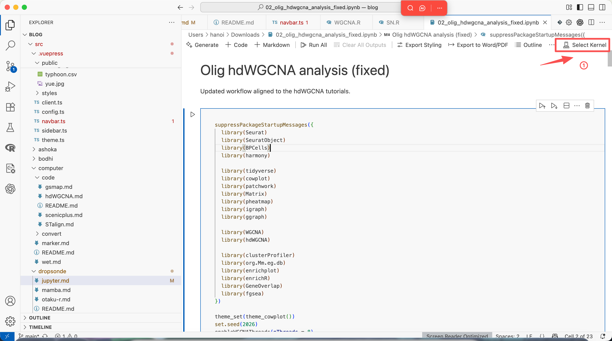
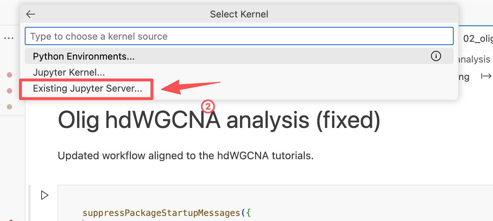
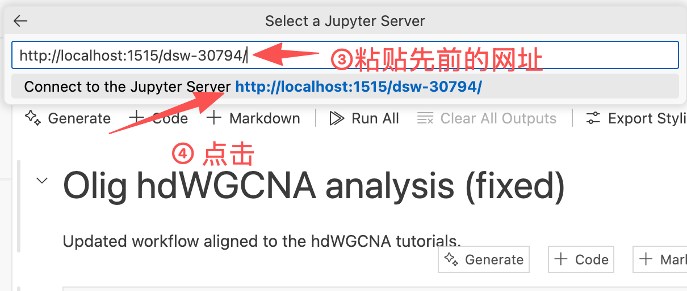
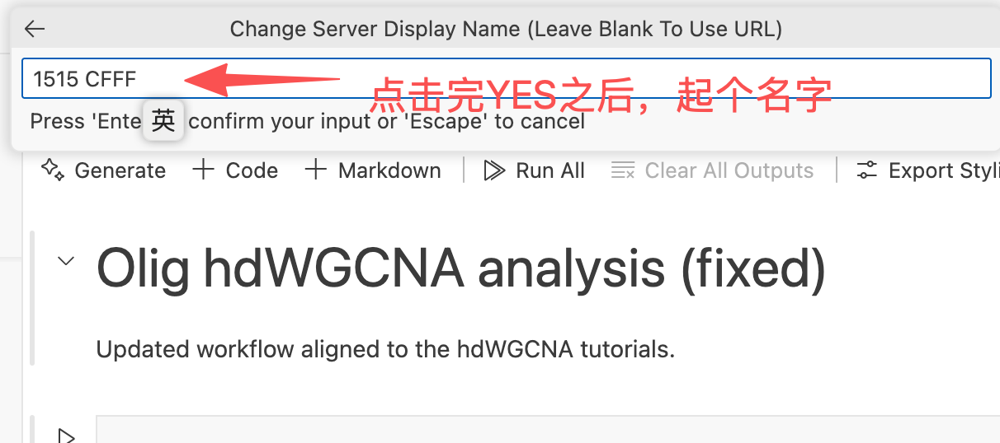

<blockquote style="font-style: italic; font-size: 1.2rem; margin-top: 10px; color: #555;">
    "Him that overcometh will I make a pillar in the temple of my God,<br>
    and he shall go no more out:<br>
    and I will write upon him the name of my God,<br>
    and the name of the city of my God, which is new Jerusalem,<br>
    which cometh down out of heaven from my God:<br>
    and I will write upon him my new name."
    <br>
    <span style="font-size: 0.9rem; color: #777;">— Revelation 3:12 (King James Version)</span>
</blockquote>
## CFFF平台

主要目的：解决连上梯子之后打不开cfff的问题。

创建一个实例之后，可以在实例界面的`操作`下面点击`远程连接`，获得下面的一行命令

```bash
ssh -p 30089 zy_22111220045@10.193.2.99
```

上面的命令直接在电脑终端运行，即就是正常打开一个CFFF上的一个终端。

好命令，不过我要稍作修改（）

### ①本地运行

```bash
ssh -N -L 1515:127.0.0.1:8088 -p 30089 zy_22111220045@10.193.2.99
```

上面的`1515`可以换为任意端口号，对应在自己电脑打开的端口。

上面的`8088`是固定的（应该），来自在DSW平台下面命令的查看

```bash
jupyter server list
Currently running servers:
http://127.0.0.1:8088/dsw-30794/ :: /cpfs01/projects-HDD/cfff-afe2df89e32e_HDD/zy_22111220045
http://127.0.0.1:8088/dsw-30794/ :: /cpfs01/projects-HDD/cfff-afe2df89e32e_HDD/zy_22111220045
```

### ②浏览器中输入

上面命令运行之后，输入密码之后即可在浏览器中直接打开

```c
http://localhost:1515/dsw-30794
#或者:
http://127.0.0.1:8890/dsw-30794/
```

然后打开之后就是和CFFF上`直接打开`相同的页面了。要说有什么用，就是后面这个方法在打开梯子的时候仍可运行。

### ③进阶：本地VSCode

同样的，可以使用`VSCode`调用服务器上的kernel。

<div style="text-align: center;" id="fig0">
    
    <div>
        <span style="color:gray">第y①步：为一个jupyter notebook选择一个kernel</span>
        <br><br>
    </div>
</div>

<div style="text-align: center;" id="fig0">
    
    <div>
        <span style="color:gray">第②步：中间步骤</span>
        <br><br>
    </div>
</div>


<div style="text-align: center;" id="fig0">
    
    <div>
        <span style="color:gray">第③步：链接远程jupyter lab</span>
        <br><br>
    </div>
</div>


<div style="text-align: center;" id="fig0">
    
    <div>
        <span style="color:gray">第④步：后续使用</span>
        <br><br>
    </div>
</div>


## 更新后版本

[三二七-汉边改革](/medicine/#三二七-汉边改革)

对`nodecw1`到`nodecw12`实行`jupyter runtime`和（主要是）`jupyter config`分离制度，实现`kernel`隔离。

```bash
# nodecw1
~/bin/start_jlab.sh 1513
# nodecw2
~/bin/start_jlab.sh 8686
# nodecw3
~/bin/start_jlab.sh 1705
# nodecw4
~/bin/start_jlab.sh 1323
# nodecw5
~/bin/start_jlab.sh 2216
# nodecw6
~/bin/start_jlab.sh 2114
# nodecw7
~/bin/start_jlab.sh 2222
# nodecw8  →Permission Denied
~/bin/start_jlab.sh 1919
# gpucw1
~/bin/start_jlab.sh 9999
# nodecw9  →Permission Denied
~/bin/start_jlab.sh 2122
# nodecw10 →Permission Denied
~/bin/start_jlab.sh 1013
# nodecw11
~/bin/start_jlab.sh 1614
# nodecw12
~/bin/start_jlab.sh 1224
# nodecw13 →Permission Denied
~/bin/start_jlab.sh 1330
```

`~/bin/start_jlab.sh`

```bash
#!/usr/bin/env bash
set -euo pipefail

PORT="${1:?usage: start_jlab.sh <port>}"
NODE="$(hostname -s)"

BASE_DIR="$HOME/.jupyter_instances/${NODE}_${PORT}"
RUNTIME_DIR="$BASE_DIR/runtime"
CONFIG_DIR="$BASE_DIR/config"
LOG_DIR="$HOME/jupyter_log"

mkdir -p "$RUNTIME_DIR" "$CONFIG_DIR" "$LOG_DIR"


export JUPYTER_RUNTIME_DIR="$RUNTIME_DIR"


export JUPYTER_CONFIG_DIR="$CONFIG_DIR"


if [ -f "$HOME/.jupyter/jupyter_server_config.py" ] && [ ! -f "$CONFIG_DIR/jupyter_server_config.py" ]; then
    cp "$HOME/.jupyter/jupyter_server_config.py" "$CONFIG_DIR/jupyter_server_config.py"
fi

if [ -f "$HOME/.jupyter/jupyter_server_config.json" ] && [ ! -f "$CONFIG_DIR/jupyter_server_config.json" ]; then
    cp "$HOME/.jupyter/jupyter_server_config.json" "$CONFIG_DIR/jupyter_server_config.json"
fi

JUPYTER_BIN="$HOME/miniforge3/bin/jupyter"

nohup "$JUPYTER_BIN" lab \
  --ServerApp.ip=127.0.0.1 \
  --ServerApp.port="$PORT" \
  --ServerApp.open_browser=False \
  --ServerApp.root_dir="$HOME" \
  > "$LOG_DIR/log_jupyter_${PORT}_${NODE}.log" 2>&1 &

echo $! > "$BASE_DIR/jupyter.pid"

echo "Started JupyterLab on node=$NODE port=$PORT"
echo "Runtime dir: $JUPYTER_RUNTIME_DIR"
echo "Config dir : $JUPYTER_CONFIG_DIR"
echo "Log file   : $LOG_DIR/log_jupyter_${PORT}_${NODE}.log"
```


### jupyter基础信息查看命令

```bash
jupyter --paths
jupyter server --show-config
jupyter kernelspec list
```

### kernel管理

#### python创建

```bash
mamba create -n py311 python=3.11 ipykernel -y
mamba activate py311
python -m ipykernel install --user --name py311 --display-name "Python (py311)"
```

#### R创建

```bash
mamba create -n r4 r-base -y
mamba activate r4
R
```

然后运行

```R
install.packages("IRkernel")# , repos="https://cloud.r-project.org")
IRkernel::installspec(user = TRUE, name = "ir-r4", displayname = "R (r4)")
q()
```


### 附：重新搭建Jupyter

##### 安装&基础配置生成

```
mamba activate base
mamba install jupyter -y
jupyter server --generate-config
# Writing default config to: '/cwStorage/home/chenzhh/.jupyter/jupyter_server_config.py'
```

##### 设置密码

```bash
jupyter server password
# Enter password: 
# Verify password:
```

##### 查看当前运行的jupyter

```bash
jupyter server list
# Currently running servers:
# http://localhost:1224/ :: /cwStorage/home/chenzh
```

##### 关掉

```bash
jupyter server stop 1224
```

##### 启动

```bash
nohup jupyter lab --config="$HOME/.jupyter/jupyter_server_config.py" \
  > "$HOME/jupyter_log/log_jupyter_1224_$(hostname).log" 2>&1 &
```


## 旧党

```bash
mamba activate base

nohup jupyter lab --port=2222 --no-browser 2>&1 >log_jupyter_2222nodecw7.log &
nohup jupyter lab --port=2019 --no-browser 2>&1 >log_jupyter_2019nodeyj1.log &
nohup jupyter lab --port=1513 --no-browser 2>&1 >log_jupyter_1513nodecw1.log &
nohup jupyter lab --port=8686 --no-browser 2>&1 >log_jupyter_8686nodecw2.log &
nohup jupyter lab --port=1705 --no-browser 2>&1 >log_jupyter_1705nodecw3.log &
nohup jupyter lab --port=1323 --no-browser 2>&1 >log_jupyter_1323nodecw4.log &
nohup jupyter lab --port=2216 --no-browser 2>&1 >log_jupyter_2216nodecw5.log &
nohup jupyter lab --port=2114 --no-browser 2>&1 >log_jupyter_2114nodecw6.log &
nohup jupyter lab --port=2222 --no-browser 2>&1 >jupyter_log/log_jupyter_2222nodecw7.log &
nohup jupyter lab --port=1919 --no-browser 2>&1 >log_jupyter_1919nodecw8.log &
nohup jupyter lab --port=9999 --no-browser 2>&1 >log_jupyter_9999gpucw1.log &

nohup jupyter lab --port=2019 --no-browser 2>&1 >log_jupyter_2019nodeyj1.log &
nohup jupyter lab --port=2122 --no-browser 2>&1 >log_jupyter_2122nodecw9.log &
nohup jupyter lab --port=1013 --no-browser 2>&1 >log_jupyter_1013nodecw10.log &
nohup jupyter lab --port=1614 --no-browser 2>&1 >log_jupyter_1614nodecw11.log &
nohup jupyter lab --port=1224 --no-browser 2>&1 >log_jupyter_1224nodecw12.log &

nohup jupyter lab --port=1330 --no-browser 2>&1 >log_jupyter_1330nodecw13.log &

```


```bash
python -m ipykernel install --user --name=merfish --display-name "Python310 (merfish)"
```

